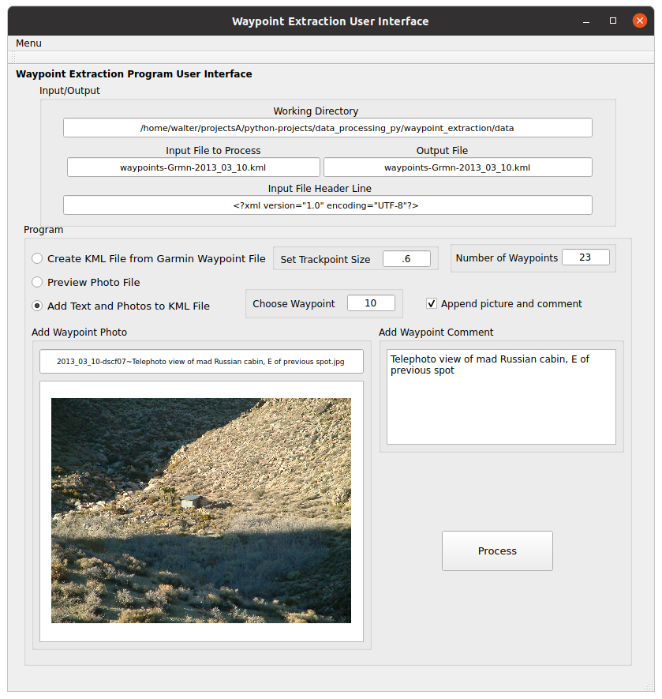

# KML file builder
A PyQt GUI example that converts Garmin waypoint data to a KML file, with waypoint editing to include pictures and comments.

## Table of Contents

* ## [Description of program](#description)
    * ### [Reason for developing](#reason_for_developing)
    * ### [Installation and operation](#installation_and_operation)
        * #### [Generating a KML file from a waypoint file](#waypoint_to_kml_file)
        * #### [Editing individual waypoints to include comments and photo links](#editing_waypoints)
    * ### [Hamburg, Missouri example](#hamburg_missouri)

* ## [Program operation](#program_operation)
    * ### [Qt Designer](#qt_designer)
    * ### [Python program](#python_program)

This graphical user interface, designed with Qt Designer, converts a GPS waypoint file such as from a Garmin or other GPS navigation device to a KML (Keyhole Markup Language) file that can be viewed by a GIS program such as Google Earth. The waypoints in the KML file can be edited to include pictures and comments. 

<a name="reason_for_developing"/>
### Reason for developing 
I enjoy hiking, and also to geographically record the locations I have gone. While disparate photos may offer memories of locations visited, associating photos to a geographic map adds dimension to the record. 

I've created several GUIs to streamline data processing work, including this app that allows one to track one's journeys by combining the visited coordinates with the corresponding photos as a record. Also consider this PyQt GUI as a template to create your own GUI for other projects. 

### Installation and operation 
I suggest creating a file structure as shown here to install this project onto your own workspace:

- ## python_projects
    - ### waypoint_extractor/KML-file-builder
        - #### data
            - #### trek_1
                - *garmin_waypoint_file.csv*
                - *photo_1*
                - *photo_2*
                - ...
            - #### trek_2
                - *garmin_waypoint_file.csv*
                - *photo_1*
                - *photo_2*
                - ...
            - #### ...
            - #### trek_n
                - *garmin_waypoint_file.csv*
                - *photo_1*
                - *photo_2*
                - ...
            - #### ui_data_conversion
                - mainwindow.py
                - mainwindow.ui
        - #### build.py
        - #### waypoint_extraction.cfg
        - #### main.py
    - ### ... *other python projects*

**waypoint_extractor** is the name I called this Python project, although it can be renamed to **kml-file-builder**, the name of the GitHub project. I use the Spyder IDE routinely for my Python projects. When one invokes **main.py**, the GUI is created, and data files can be processed. The configuration file, **waypoint_extractor.cfg**, contains the program's previous settings and populates the GUI with those values when the application is reopened. 

Running **build.py** will compile the PyQt code that creates the graphical user interface; this needs to be only done after any GUI widgets have been changed by **Qt Designer**. The folder **ui_data_conversion** contains the GUI file generated by **Qt Designer**, **mainwindow.ui**. When this file is run by **build.py**, **mainwindow.py** is created. This allows the GUI to be generated and run when **main.py** is invoked through the Python IDE. 

The **data** folder contain both input and output processed files. The input files are the GPS device waypoint file and any photographic files to be associated with waypoints. The KML output file is created in the same directory. I've included two examples of hikes that are processed by this app: one to the "Mad Russian's Cabin" in the Argus Mountains in California, and the other in the region of Hamburg, Missouri, near Defiance, St. Charles County, by the Missouri River. 

                        Fig. 1. Screenshot of GUI in operation.

#### Generating a KML file from a waypoint file 

This app will create a KML waypoint file from one generated by a GPS tracking device such as a Garmin. The first example is of a hike I took to the "Mad Russian's Cabin," a place in the Mojave Desert now technically part of China Lake Naval Base. 

The background to the Mad Russian's Cabin is that in 1943, a Naval proving ground in the Mojave Desert was established covering over 1,100,000 acres to test naval ordinance. This required eminent domain to clear the land of the many ranchers, miners, and others that had homesteaded there, estimated to be nearly 1800 persons. One such miner who settled on the land was from Russia, who built a small corrugated metal dwelling in the 1930's, known locally as the "Mad Russian's Cabin." Although it is on the military installation, it is far removed from any activities on the base, being near the eastern border of the North China Lake section. It has become a favorite hike, although rather obscure and difficult to get to. See *https://cnrsw.cnic.navy.mil/Installations/NAWS-China-Lake/Operations-and-Management/Environmental-Support/Cultural-Resources/* and *https://www.flickr.com/photos/inyopaul/albums/72157622730781221/*. 

To get there was a long and difficult hike into the Argus Mountains, east of Searles Valley. The trail, if it can be called one, follows scant burrow trails decades old. The path to the cabin is through an adjacent canyon rather than the one it lies in, as the direct canyon is nearly impassible. I had difficulty finding the cabin when I jumped from the adjacent canyon to the direct one, having to triangulate using a topographic map I brought along. 

The cabin consists of corrugated metal siding and roofing, most of which has writings on it about politics and thoughts written by the Russian inhabitant. He probably would have enjoyed Facebook, or some other online media to post his conspiratorial theories. 

I took many photos along the trail, while also recording waypoints on my Garmin GPS. When I returned to the trail-head many hours later, with virtually no daylight left, I nearly walked into my vehicle, having followed only the starlight illuminated trail in the desert landscape. 

**Figure 2** shows some of the waypoints generated by the Garmin GPS of the hike, which I've included as files **waypoints-Grmn-2013_03_10.txt** and **waypoints-Grmn-2013_03_10.csv**; the ~.txt file will open with a text editor and the ~.csv file with a spreadsheet program. 

    type,ident,lat,long,y_proj,x_proj,comment,display,symbol,...
    WAYPOINT,504,35.90068043,-117.39939792,4260486.42519153,-1721587.20566804,10-MAR-13 14:15,...
    WAYPOINT,505,35.90399967,-117.40295151,4260951.59211864,-1721815.6232356,10-MAR-13 14:25,...
    WAYPOINT,506,35.90485143,-117.40504808,4261100.15469202,-1721983.88447623,10-MAR-13 14:36,...
    WAYPOINT,507,35.90561285,-117.40597168,4261209.53847171,-1722046.30880252,10-MAR-13 14:37,...
    WAYPOINT,508,35.90552417,-117.40784084,4261245.51434056,-1722222.00236483,10-MAR-13 14:43,...
    ...

                                Fig. 2. Garmin waypoint file.

To create a KML file from the waypoint file generated by the navigation device open the waypoint extractor program. 

Select **Menu** at the upper left. A drop-down menu offers the choice of either **Waypoint File** or **Photo File**; select the **Waypoint File** as an input. 

With the **Open File** popup window, navigate to the location of the input waypoint file, in this example, **waypoints-Grmn-2013_03_10.csv** in the **data** folder, and select **Open** at the lower right. The **Input File to Process** text box populates with the input file's name. 

Next, select the **Create KML file from Garmin Waypoint File** radio-button. 

The **Set Trackpoint Size** can be set to a value of typically ***.4*** to ***1.2***; this is the dot-size that will represent the KML file waypoints. I have set this at ***.6*** for this example. 

Select the **Process** button at the lower right, and the output KML file should be created, as shown in the **Output File** text-box, i.e., **waypoints-Grmn-2013_03_10.kml**. Note that the file's base name has not changed, only the extension, changing from **csv** to **kml**. 

The **Number of Waypoints** text-box should show the number of waypoints that are detected in the file, in this case, ***23*** - see **Figure 3**.

The generated KML file can then be loaded into a GIS viewing program, such as **Google Earth** (formerly **Keyhole**), and will show waypoints as dots of size ***.6***. 

                Fig. 3. Using the app to create a KML file from a waypoint file.

#### Editing individual waypoints to include comments and photo links 

Once the generic KML file is created, individual waypoints can be edited to include comments and links to photos taken on the outing. 

For this example, a text file, **mad_russian's_cabin_hike_waypoints.txt**, is included as a guide that associates each waypoint with corresponding comments or photos. To edit the first waypoint, refer to the first lines, listing the waypoint, e.g., **1**; a link to a photo; and a comment:

    1
    "2013_03_10-dscf01~Near Homewood Cyn Rd, looking NNW on way to mad Russian cabin.jpg"
    Near Homewood Cyn Rd, looking NNW on way to mad Russian cabin

This indicates that waypoint **1** has a photo and caption associated with it. On the app, open the just created KML file **waypoints-Grmn-2013_03_10.kml** by again selecting **Menu** at the upper left and then **Waypoint File** from the drop-down menu. 

Navigate to the **waypoints-Grmn-2013_03_10.kml** file and select it; it will appear in the **Input File to Process** text-box. I sometimes will make a copy of the KML file for a backup in order to not write on the original file, e.g., copy **waypoints-Grmn-2013_03_10.kml** to **waypoints-Grmn-2013_03_10-pix.kml** to indicate it has photos, and edit these waypoints. The selected waypoint file will be both the input and output for all the waypoint edits. 

Next, again select **Menu** and then **Photo File** from the drop-down menu. Navigate to the photos, and select **2013_03_10-dscf01~Near Homewood Cyn Rd, looking NNW on way to mad Russian cabin.jpg**, the photo associated with waypoint **1**. 

Select the **Preview Photo File** radio-button. 

Then select **Process**, to see the photo in the photo display box. At this point nothing is written to the KML file; this only lets you see the photo you want to associate with the particular waypoint. 

Paste the photo caption, "***Near Homewood Cyn Rd, looking NNW on way to mad Russian cabin***," into the **Add Waypoint Comment** text-box. 

Select the **Add Text and Photos to KML File** radio-button. 

Put **1** into the **Choose Waypoint** text-box. 

Finally, select **Process**, and the first waypoint will have a link to the photo and caption added to it. When the **waypoints-Grmn-2013_03_10-pix.kml** is opened by **Google Earth** and waypoint **1** is selected, it will appear as in **Figure 4**, with a camera as the waypoint symbol instead of a dot. 

            Fig. 4. Screenshot of waypoint 1.

The same procedure is followed to add the photo and comment to waypoint **2**, given here:

    2
    "2013_03_10-dscf02~Cyn to mad Russian cabin, looking at mine.jpg"
    Cyn to mad Russian cabin, looking at mine

The **Input File to Process** contents remain the same: ***waypoints-Grmn-2013_03_10-pix.kml***.

The photo, **"2013_03_10-dscf02~Cyn to mad Russian cabin, looking at mine.jpg"**, is located by selecting **Menu** then **Photo File**, and then selecting the **Preview Photo File** radio-button, and then **Process** to see if the correct photo is selected. The photo name will appear in the text-box above photo image itself. 

Then select the **Add Text and Photos to KML File** radio-button. Put **2** into the **Choose Waypoint**. 

Put the photo caption, ***"Cyn to mad Russian cabin, looking at mine"*** into the **Add Waypoint Comment** text-box, and select **Process**. The second waypoint will have been edited. 

To add only a comment to a waypoint and not a photo, follow these steps for waypoints **3** and **4**. 

Remove any photo file name from the photo name text-box, put the desired waypoint in the **Choose Waypoint** text-box, i.e., **3**. 

Copy the waypoint comment, **Campfire and kettle**, into the **Add Waypoint Comment** text-box. 

Select **Process**, and the KML file is edited for waypoint **3**. The waypoint symbol is not changed from a dot, unlike when a photo is added - I may change this. The result is seen in **Figure 5**. 

            Figure 5. Result of adding only a comment to a waypoint in KML file.

For waypoint **4**, the comment **Boundary marker next to ravine** is added by the same procedure. 

Should the waypoint have multiple photos associated with it, such as with waypoint **10**, follow these steps. 

The KML file name **waypoints-Grmn-2013_03_10-pix.kml** should already be in the **Input File to Process** text-box. 

Select the first photo associated to waypoint **10**, **"2013_03_10-dscf06~View N towards cabin; obscured by hill.jpg"** by selecting **Menu** then **Photo File**, and then select radio-button **Preview Photo File** and then **Process**, to see the photo in the image box. 

Select the **Add Text and Photos to KML File** radio-button, and put **10** into the **Choose Waypoint** text-box. Copy the caption ***View N towards cabin; obscured by hill*** into the **Add Waypoint Comment** text-box, then select **Process** to edit the waypoint. 

To add the second photo to the waypoint, select the appropriate photo, **"2013_03_10-dscf07~Telephoto view of mad Russian cabin, E of previous spot.jpg"**, and view it by selecting the **Preview Photo File** radio-button again. Select the **Add Text and Photos to KML File** radio-button, and this time check the **Append Picture and Comment** check-box; this will append the picture to the existing one without erasing it. 

Put the **Telephoto view of mad Russian cabin, E of previous spot** comment into the **Add Waypoint Comment** text-box, and select **Process**, to have both pictures associated with waypoint **10**. The effect will be as shown in **Figure 6**, showing two pictures for waypoint **11**. 

            Fig. 6. Waypoint with two photos and captions shown by sliding menu.

The when all the waypoints are edited, the result is Figure 7, as shown in Google Earth. 

                        Figure 7. Entire satellite image of trek.

Waypoint **6** shows the two canyons: the right (northeast) one leads directly to the cabin - although nearly impassable, while the left (southwest) one is recommended. At waypoint **9** I decided to jump to the other canyon, but became lost at waypoint **10**, where I triangulated, moving east a few hundred yards, to finally see the cabin. 

I tried to return to the trail-head by the impassable canyon at waypoint **12**, but returned to the passable canyon by the path seen by waypoints **13**, **14**, **15**, and **16**.

### Hamburg, Missouri example 

Another trek example is a location where I wanted to explore the abandoned town of Hamburg, near Defiance, Missouri. Lower Hamburg was founded in 1836 and Upper Hamburg in 1840 by German immigrants. Hamburg and neighboring Howell where taken over by the Federal Government through eminent domain in 1941 to build a TNT and DNT processing facility at Weldon Springs for the war effort (see the **TNT Story**, at https://thetntstory.blogspot.com/). Both towns, along with Toonerville were evacuated, the houses and other dwellings torched and leveled, requiring all the inhabitants to relocate, many of whom were not well recompensed for their land until a Supreme Court ruling after WWII. 

                            Figure 8. Satellite image of Hamburg area.

I wanted to hike along the abandoned town road and explore some of the former dwellings, such as the school and houses. I found all the area covered with very dense vegetation and couldn't navigate well, even though I had GPS coordinates of some sites. I started out at waypoint **1**, where a railroad grade leaves Highway 94 - see **Figure 8**. I continued east through the dense foliage, and finally located the old road at waypoint **2** (**Figure 9**). This road may have been abandoned since the end of WWII. I continued on to the "Katy" Trail and the Missouri River, then turning north on the road viewing such sites as the Roth-Heck Cemetery, where a Civil War musician, Philip Heck, is interred, and Yahn Dam, a 1930's attempt to create a recreational lake. I continued marking some waypoints, such as the road's intersection with the railroad grade, waypoint **8**, and then finally to the gated entrance of the road from Highway 94, waypoint **10** - see **Figure 10**.

     		Figure 9. Hamburg road, very overgrown.

	Figure 10. Red gate to left blocking Hamburg road, very overgrown.

Viewing a past satellite image can help locating overgrown roads and trails, as seen in **Figure 11**, taken in April 2007, when vegetation had receded. I added extra waypoints to show sites I planned to see. 

KML plots as these show how a KML file can show extra geographical information when planning for a return hike. In this case, hiking in late winter or early spring is advantageous since the foliage is reduced. If hiking in summer, be sure to use a bug repellent; chiggers abound! 

                Figure 11. Satellite image of Hamburg area with extra waypoints, April 2007.

### Program operation 
Here is a description of the inner workings of the program.

#### Qt Designer 
**Qt Designer**, a WYSIWYG Python GUI creator that allows manipulation of PyQt code to design very useful GUIs for a variety of applications. I have used Qt Designer for many Python GUIs that streamlined my data processing. 

The current designer layout for the waypoint extraction program is shown in **Figure 12**. Among the widgets I used are text-boxes, radio-buttons, a check-box, and a push-button. Within Qt Designer these widgets can be moved around, copies made and put elsewhere, and the their properties changed,or more widgets added by the toolbar on the left. 

                                        Fig. 12. PyQt GUI.

When a particular widget is selected from the Designer GUI, the properties are displayed at the **Object Inspector** panel on the right, as well as the **Property Editor** panel below it. Widget characteristics can be changed, such as text, font size and color, and position. Widgets are labeled so as to link them to the Python program in a signal-to-slot manner, e.g., ***radBtnExtractWypnts***, the radio-button that selects the KML output file generation. 

**QT Designer** creates an XML file, **mainwindow.ui**, that is then compiled within the Python IDE to create the file that generates the interactive GUI, **mainwindow.py**.

#### Python program 
Running the **build.py** program, shown below, in the project root directory **waypoint_extractor** compiles the **mainwindow.ui** XML file to create a Python file, **mainwindow.py**:

**build.py** code:
    # Build qtpy project designed by Designer. 
    from qtpy import uic
    # User Interface Compiler.
    uic.compileUiDir("ui_waypoint_extractor")

The contents of **mainwindow.py** are imported into the **main.py** program, shown in this code:

    # Import graphics generated by QtPy program. 
    from ui_waypoint_extractor.mainwindow import Ui_MainWindow

Next, the GUI is configured. Two modules are imported into the program: **numpy** to work with arrays, and **QPixmap** to format and present photo images for the user to select and choose. 

The **mainWindow** class is then built, and the various widgets from PyQt are accepted into the GUI in a signal-to-slot configuration. The menu selection that allows finding the input file is configured, as are all the text-boxes, radio-buttons, a check-box, and finally the process-button to run the program. 

Next, the various radio-buttons are configured that connect to the selected function, i.e: ***extract_waypoints***, ***preview_photo***, and ***edit_waypoint***. In the **extract_waypoints** function, two defined functions, **shaded_dot_tmp** and **waypoint_tmp_func** help format the waypoints in the KML ouput file. 

Next, the configuration file, **dataconversion.cfg** in the main directory is read. All the values from the previous session are loaded as a convenience to the user. If a configuration file is not found, it is created. 

Some variables need to be shared across the functions; **global** does this, e.g., ***global homedir, fileinpath, flg_append_waypoint***. 

The **file_open** function determines the input file path from the working directory and input file. Finally, the **onProcessClick** function begins the processing. Within this function the output file name is created from the input file-type choice. For example, with the radio-button **Create KML File from Garmin Waypoint File** selected, an input file, e.g., ***data.csv***, will generate an output file ***data.kml***. If the **Add Text and Photos to KML File** radio-button is selected, the output file name remains the same as the input file name. 

Before other computations occur, the values in the text-boxes and radio-buttons and check-boxes are written to the configuration file, **configuration.cfg**, as information for the next session. Storing the values before any processing saves the values before any anomaly or crash might happen. 

The function **extract_waypoints** opens up the input file, which should be a waypoint file generated by a GPS navigation device such as a Garmin, which I used. The file format is shown in **Figure 2**, a CSV (Comma Separated Values) data file with a header line. This data is read in as a data-frame, whose category is identified by the header. The **lat** (latitude), **long** (longitude), **comment** (date and time), and **altitude** (above mean sea level) values are extracted for each waypoint, and placed into the output KML waypoint file. 

The **preview_photo** function allows one to view a selected photo to determine if it should be linked to by the waypoint in the KML file. The selected photo appears in the **graphicsView** box, along with its file name in the **txtWaypntPix** text-box above it. 

Finally, the **edit_waypoint** function allows one to edit a KML waypoint and add a comment and photo link or append several if desired by selecting the **checkBoxAppendTxt** checkbox. 

The last lines instantiate the GUI window and kept it open for view until terminated. 
